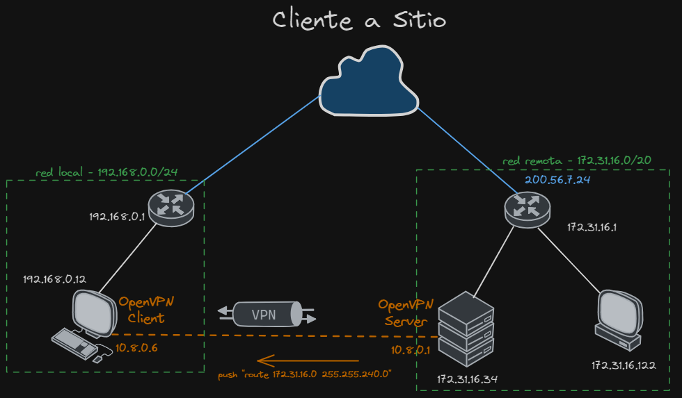
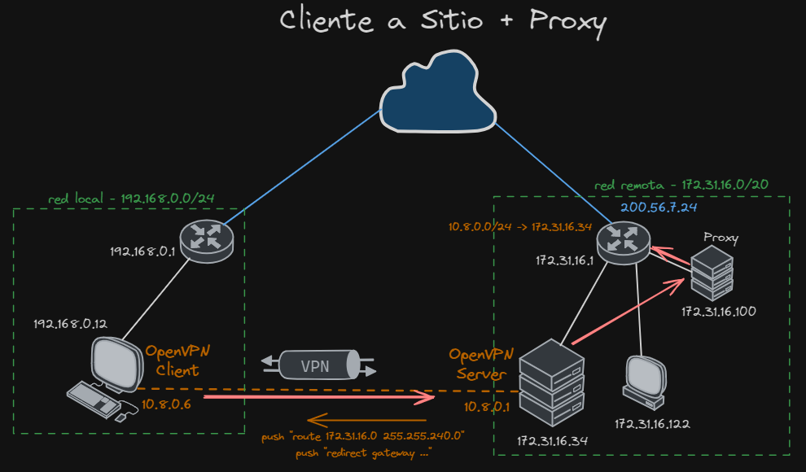
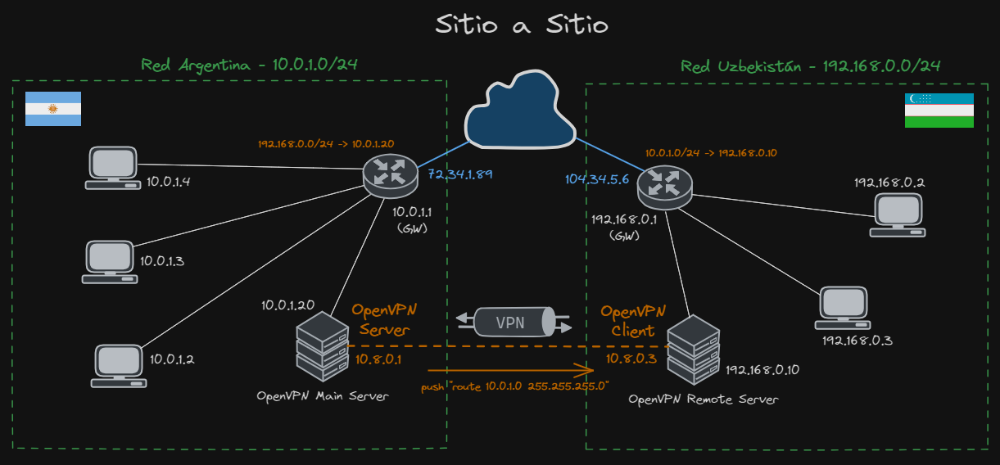
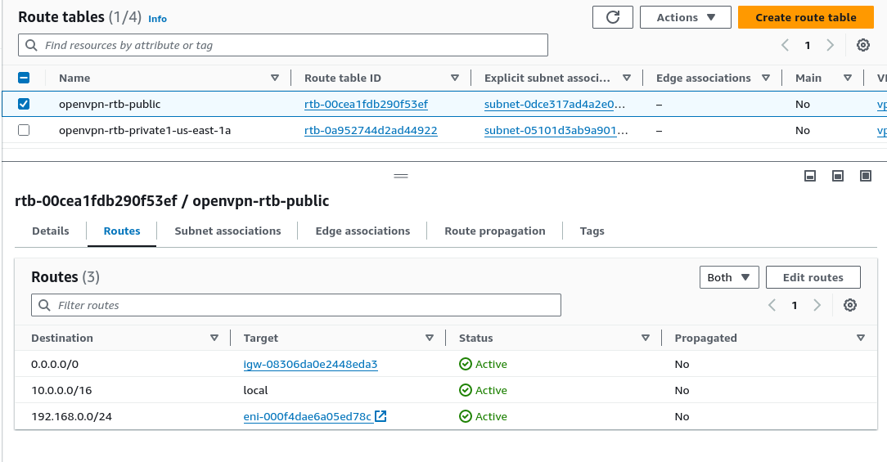
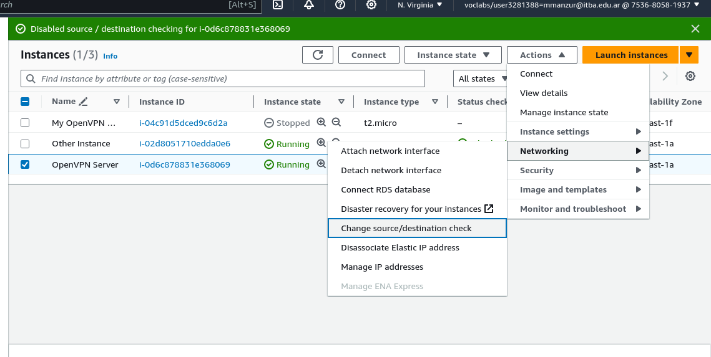
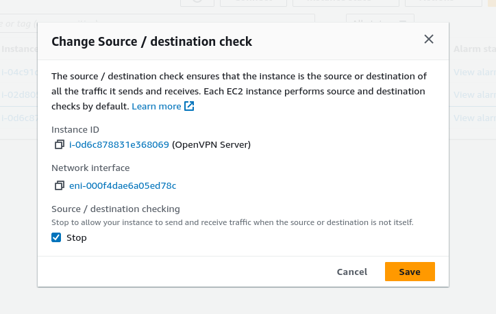
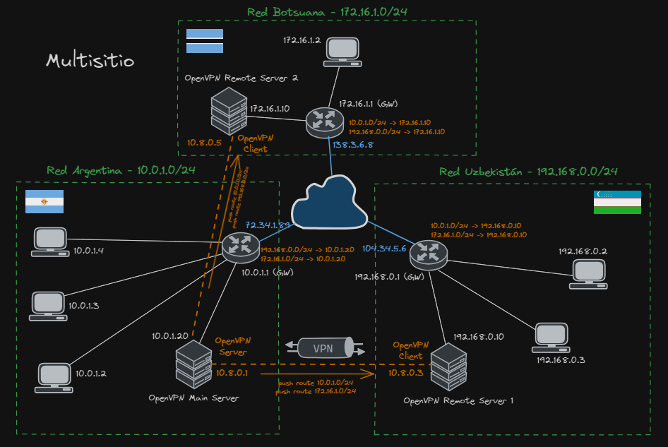

# Tutorial OpenVPN
Este es la guía de OpenVPN para la presentación de Redes de Comunicación. Se van a levantar distintas arquitecturas de VPNs mediante clientes y servidores OpenVPN y se agregan algunos extras para administrar y filtrar contenido en redes de OpenVPN.

### Integrantes el grupo
+ Manzur Matías 62498
+ Rupnik Franco 62032
+ Shih Federico 62293
+ Báez Mauro 61747

# Conexión Cliente a Sitio



A continuación, vamos a explicar como levantar un servidor y un cliente OpenVPN en la configuración cliente a sitio. Sin embargo, la configuración base tanto para el cliente como para el servidor será la misma para los otros tipos de conexión detallados más adelante.

# OpenVPN Server

Instalamos las siguientes herramientas necesarias

```bash
sudo apt update
sudo apt install net-tools openvpn easy-rsa
```

## PKI Setup

Primero necesitamos crear los certificados SSL/TLS para autenticación entre el cliente y servidor VPN. Para ello vamos a crear:

- Una clave privada y un certificado con clave pública para el servidor y para cada cliente
- Un certificado y clave de la autoridad certificante primaria (CA), para firmar los certificados del servidor y los clientes.

### Creamos la Autoridad Certificante (CA)

```bash
# Creamos un directorio easy-rsa
sudo make-cadir /etc/openvpn/easy-rsa
# A partir de ahora, nos cambiamos a modo root para poder acceder a este directorio
sudo -i
cd /etc/openvpn/easy-rsa
./easyrsa init-pki
./easyrsa build-ca
# Este último comando nos pedirá una Key Passphrase para encriptar 
# la clave privada a generar y un CNAME para nuestro CA.
# El certificado de la CA se generará en: '/etc/openvpn/easy-rsa/pki/ca.crt'
```

### Generamos claves y certificado del server

```bash
# seguimos en el mismo directorio en modo root:

# 'openvpn_server' es el nombre del servidor, lo podemos cambiar a lo que queramos
./easyrsa gen-req openvpn_server nopass
# Nos pedirá un CNAME para el servidor, en este ejemplo cname='openvpn_server'
# Se generaron dos archivos:
# req: /etc/openvpn/easy-rsa/pki/reqs/openvpn_server.req
# key: /etc/openvpn/easy-rsa/pki/private/openvpn_server.key

# generamos los parámetros para Diffie Hellman
./easyrsa gen-dh
# se generará un archivo en: /etc/openvpn/easy-rsa/pki/dh.pem

# finalmente, creamos el certificado para el servidor
./easyrsa sign-req server openvpn_server
# nos pedirá que ingresemos la misma Key Passphrase generada anteriormente
# para desencriptar la clave privada del CA y firmar el certificado
# se generará el certificado en: /etc/openvpn/easy-rsa/pki/issued/openvpn_server.crt
```

### Generamos certificados para cada cliente

```bash
# Si queremos generar el par de claves en el cliente, 
# podemos hacerlo y pasarle al servidor el archico .req
# Luego, podemos importarlo con './easyrsa import-req path/to/myclient1.req myclient1'
# En este ejemplo generamos todo desde el servidor para mayor practicidad:
./easyrsa gen-req myclient1 nopass
# Esto nos pedirá elegir un CNAME para el cliente, en este ejemplo cname='myclient1'
# Se generaron dos archivos:
# req: /etc/openvpn/easy-rsa/pki/reqs/myclient1.req
# key: /etc/openvpn/easy-rsa/pki/private/myclient1.key

# Luego de haber generado o importado el .req del cliente, creamos su certificado:
./easyrsa sign-req client myclient1
# nos pedirá que ingresemos la misma Key Passphrase generada anteriormente
# para desencriptar la clave privada del CA y firmar el certificado
# se generará el certificado en: /etc/openvpn/easy-rsa/pki/issued/myclient1.crt
```

### Copiamos archivos generados al directorio del servidor

```bash
# Para mayor practicidad, copiamos los archivos generados anteriormente al directorio 
# de configuración del servidor OpenVPN
cp pki/dh.pem pki/ca.crt pki/issued/openvpn_server.crt pki/private/openvpn_server.key /etc/openvpn/
# También copiamos los archivos que necesitamos enviar al cliente a un directorio
# personal para poder enviarselos como desee (ej.: via scp)
# Aclaración: quizás sea necesario modificar los permisos de los archivos (chmod) 
# una vez copiados para poder enviarlos correctamente
# En el caso de que la clave del cliente haya sido generada en el servidor, 
# le enviamos también su .key
cp pki/ca.crt pki/private/myclient1.key pki/issued/myclient1.crt /home/ubuntu
# ya podemos salir del modo root, con el comando:
exit
```

## Server Setup

### Configuración del Servidor

```bash
cd /etc/openvpn
# Copiamos un template de archivo de configuración de OpenVPN
sudo cp /usr/share/doc/openvpn/examples/sample-config-files/server.conf /etc/openvpn/myserver.conf
# Entramos a editar este archivo con nuestro editor de confianza:
sudo vim myserver.conf
```

En este archivo `myserver.conf` nos aseguramos de que se encuentren las siguientes líneas:

```
ca ca.crt
cert openvpn_server.crt
key openvpn_server.key
dh dh.pem
```

Que le indican al servidor dónde se encuentran los archivos de la PKI generados anteriormente.

Otras **configuraciones relevantes** que podemos hacer son:

```python
# En qué puerto TCP/UDP escuchará el servidor. Por si queremos hostear más de uno en el mismo host
port 1194
# Usar TCP o UDP (comentar con ';' la opción que NO se usará)
;proto tcp
proto udp
# Subred para la VPN. El server se asignará la 10.8.0.1, el resto de las ips serán para los clientes
server 10.8.0.0 255.255.255.0
# Pisa o agrega la entrada a la tabla de ruteo de los clientes que se conecten al servidor
push "route 172.31.16.0 255.255.240.0"
# Descomentar para permitir que los clientes se puedan ver entre sí
;client-to-client
# Descomentar para redirigir el default gateway de todos los clientes a través de la VPN
;push "redirect-gateway def1 bypass-dhcp"
# Descomentar para que múltiples clientes se conecten con el mismo certificado. No Recomendado
;duplicate-cn
# Descomentar para setear la cantidad máxima de clientes conectados
;max-clients 100
```

Cuando estamos en Cliente a Sitio, en el caso de que querramos que el cliente acceda a otros hosts de la red del sitio, o a internet usando al túnel como default gateway, tenemos dos opciones:

- Agregar a la tabla de ruteo de la red del sitio, que los paquetes con IP destino perteneciente a la subred del túnel (10.8.0.0/24), sean redirigidos a la IP privada del servidor OpenVPN (172.31.16.34). Aclaración: si el sitio se encuentra en una red AWS, está opción no funcionará para salir a internet, ya que el Internet Gateway hace statless NAT, se deberá hacer la otra opción, o bien utilizar un web proxy.
- Hacer NAT de los paquetes provenientes del túnel para que salgan a la red del sitio con la IP origen del servidor OpenVPN. Podemos lograr esto con: `sudo iptables -t nat -A POSTROUTING -s 10.8.0.0/24 -o eth0 -j MASQUERADE` . Aclaración: la configuración sobre iptables no es permamente y se debera hacer con cada reinicio.

Creamos una clave de autenticación TLS (TA key):

```bash
# En el directorio /etc/openvpn
sudo openvpn --genkey --secret ta.key
# Copiamos la ta.key a un directorio de conveniencia para enviarselo al cliente
sudo cp ta.key /home/ubuntu
```

Habilitamos el forwardeo de paquetes IPv4 en el servidor

```bash
sudo vim /etc/sysctl.conf
# y descomentamos la línea:
#net.ipv4.ip_forward=1
# recargamos sysctl
sudo sysctl -p /etc/sysctl.conf
```

Finalmente, abrimos el servidor con el comando:

```bash
sudo systemctl start openvpn@myserver
```

Documentación oficial para Ubuntu: [https://ubuntu.com/server/docs/how-to-install-and-use-openvpn](https://ubuntu.com/server/docs/how-to-install-and-use-openvpn)

## Usar un Proxy para acceder a Internet



Vamos a usar instancias dos EC2 (Servidor OpenVPN y Servidor Proxy) IPs publicas distintas para poder mostrar fácilmente que se usa un proxy, pero no debería haber problema si solo se tiene una IP publica asignada al Router lo importante es que se redirija el tráfico hacia el Proxy.

Vamos a descargar TinyProxy - un proxy open source liviano, para ello vamos a correr los siguientes comandos en la terminal de la instancia Proxy:

```bash
# Vamos a instalar unos paquetes que son necesarios para instalar TinyProxy desde una compilacion
sudo apt update
sudo apt install tinyproxy

# Con esto ya tenemos instalado TinyProxy, para informacion sobre los comandos
# Referirse a https://tinyproxy.github.io/
```

Teniendo TinyProxy instalado vamos a crear un archivo de configuracion para poder correr el servidor, usamos las siguientes lineas:

```bash
# Vamos a un directorio de conveniencia
cd /etc/tinyproxy
sudo cp tinyproxy.conf tinyproxy.conf.copy # creamos una copia del default
sudo cat /dev/null > tinyproxy.conf # limpiamos el archivo
sudo vim tinyproxy.conf
```

Vamos a escribir las siguientes lineas en `tinyproxy.conf` en formato .conf (opciones se pueden ver en [https://tinyproxy.github.io/](https://tinyproxy.github.io/) ), un ejemplo podria ser:

```bash
User nobody
Group nogroup

Port 8888
Listen 172.31.64.43
BindSame yes

Timeout 600

DefaultErrorFile "/usr/share/tinyproxy/default.html"
StatFile "/usr/share/tinyproxy/stats.html"
Logfile "/var/log/tinyproxy/tinyproxy.log"
Syslog On
LogLevel Info
PidFile "/var/run/tinyproxy/tinyproxy.pid"
ViaProxyName "tinyproxy1"

ConnectPort 8888
ConnectPort 80

# The following two ports are used by SSL.
ConnectPort 443
ConnectPort 563
```

Para puerto se usa el `8888` pero se puede elegir otro puerto, si se usa uno menor a `1024` se deberá usar sudo. Para Listen se debe poner la IP de la interfaz por la cual queremos que escuche, en nuestro caso `172.31.64.43` . BindSame se usa para que la IP por donde se bindea la misma IP por donde se escucha.

- Asegurarse que se tiene abierto el firewall en el puerto 8888

Ahora solo falta reiniciar el servidor proxy con la nueva configuracion

```bash
sudo systemctl restart tinyproxy
```

Ahora vamos al Servidor OpenVPN y vamos a revisar algunas configuraciones dentro del .conf:

```bash
cd /etc/openvpn/
sudo vim myserver.conf

#Vamos a revisar que esten las siguientes lineas descomentadas o que esten presentes
push "redirect-gateway def1 bypass-dhcp"
push "route 172.31.16.0 255.255.240.0" #la subred del sitio del server

#Luego vamos a realizar un restart o start si no lo teniamos andando
sudo systemctl restart openvpn@myserver
```

Finalmente, para los clientes, se deberá configurar el servidor proxy como intermediario. Esta configuración dependerá del cliente, para windows se deberá hacer por medio del menu de opciones y para el caso de Linux se podrá fijar el proxy de manera explícita o con variables de entorno.

```bash
#Usarlo explicito
curl -x http://172.31.64.43:8888 ipinfo.io
#Setear variables de entorno
export http_proxy="http://172.31.64.43:8888"
export https_proxy="http://172.31.64.43:8888"
export HTTP_PROXY=${http_proxy}
export HTTPS_PROXY=${https_proxy}
```

Para desactivar el proxy simplemente correr:

```bash
unset http_proxy
unset https_proxy
unset HTTP_PROXY
unset HTTPS_PROXY
```

- Para que los scripts cambien las variables de entorno de la consola en linux es necesario correrlos como        `. ./script.sh`

### (Extra) Usar el web proxy para filtrar sitios web

Teniendo el proxy web, tiny-proxy, ya instalado y configurado vamos a crear un archivo con las reglas de filtrado(una regla por línea y comentarios con # → son expresiones regulares POSIX)

```bash
cd /etc/tinyproxy/
sudo touch filter.txt #creamos el archivo
sudo vim filter.txt #lo abrimos con nuestro editor de confianza

#Vamos a dar un ejemplo de posibles filtrados:
# filtrar exactamente cnn.com
^cnn\.com$
 
# filtrar todos los subdominios de pero no cnn.com en si
.*\.cnn.com$
 
# filtra cualquier dominio que tenga cnn.com en el, como: xcnn.comfy.org
cnn\.com

# filtrar cualquier dominio que empieza con adserver
^adserver

```

Teniendo el archivo con los filtrados, vamos a añadir el archivo a la configuración con la línea: `Filter "/etc/tinyproxy/filter.txt"` (si el archivo filter no esta en el mismo directorio, seria poner el path al mismo), usando el archivo de configuración anterior quedaría así:

```bash
vim tinyproxy.conf #abrimos el archivo para editar

User nobody
Group nogroup

Port 8888
Listen 172.31.64.43
BindSame yes

Timeout 600

DefaultErrorFile "/usr/share/tinyproxy/default.html"
StatFile "/usr/share/tinyproxy/stats.html"
Logfile "/var/log/tinyproxy/tinyproxy.log"
Syslog On
LogLevel Info
PidFile "/var/run/tinyproxy/tinyproxy.pid"
ViaProxyName "tinyproxy1"

ConnectPort 8888
ConnectPort 80

# The following two ports are used by SSL.
ConnectPort 443
ConnectPort 563
Filter "/etc/tinyproxy/filter.txt"
```

Luego con volver a iniciar el proxy, con `sudo systemctl restart tinyproxy`,ya tenemos las reglas de filtrado puestas.

# OpenVPN Client

```bash
sudo apt install openvpn
cd /etc/openvpn
sudo cp /usr/share/doc/openvpn/examples/sample-config-files/client.conf /etc/openvpn/
# Copiar los archivos traídos desde el servidor al directorio actual
# estos son: 'ca.crt', 'myclient1.crt', 'myclient1.key', 'ta.key'
# Entramos a editar este archivo con nuestro editor de confianza:
sudo vim client.conf
```

En este archivo `client.conf` nos aseguramos de que se encuentren las siguientes líneas:

```
client
remote <server_address> <serverport>

ca ca.crt
cert myclient1.crt
key myclient1.key
tls-auth ta.key 1
```

Finalmente, podremos inicializar el cliente vpn con el comando:

```bash
sudo systemctl start openvpn@client
```

Podremos chequear que la conexión VPN se hizo de las siguientes formas:

```python
# Ver si se inició correctamente el cliente
sudo systemctl status openvpn@client
# Ver si se creo la interfaz tun0
ifconfig
ip addr show dev tun0
# Ver si se modificó la tabla de ruteo
route -n
# Ver si llega un ping al 10.8.0.1
ping 10.8.0.1
```

# Conexión Sitio a Sitio



En este ejemplo, llamaremos “red principal” a la red Argentina de la figura, “servidor principal” al servidor OpenVPN de esa red, y “red remota” a la red Uzbekistán, con “servidor remoto” como el servidor cliente OpenVPN.

Al igual que para la conexión cliente a sitio, para realizar la conexion sitio a sitio vamos a necesitar levantar un servidor OpenVPN y un cliente OpenVPN. Vamos a usar al cliente VPN para que funcione como enrutador de paquetes de la red remota a través del túnel VPN. Para el caso de la red principal, el servidor será el que enruta hacia el otro lado.

## Servidor Principal

Primero, levantamos un servidor OpenVPN cómo hicimos en el caso de cliente a sitio.

Luego, desde el servidor principal vamos a generar los certificates y keys para el servidor cliente remoto:

```bash
# Primero vamos a ir a la carpeta de easy-rsa que creamos en el ejemplo de cliente a sitio
sudo -i
cd /etc/openvpn/easy-rsa
# Vamos a generar el certificado para la oficina remota
./easyrsa gen-req remote-server nopass

# Luego de haber generado o importado el .req del servidor remoto, creamos su certificado:
./easyrsa sign-req client remote-server
# Esto nos genera un certificado y una llave para el servidor remoto
# Necesitaremos hacerle llegar al servidor remoto:
# ta.key, remote-server.crt, ca.cert, y remote-server.key (si es que fue creada desde este servidor)
```

Además, en el servidor principal debemos agregar una configuración adicional en el `server.conf`:

```bash
# En qué puerto TCP/UDP escuchará el servidor. Por si queremos hostear más de uno en el mismo host
port 1194
# Usar TCP o UDP (comentar con ';' la opción que NO se usará)
;proto tcp
proto udp
# Subred para la VPN. El server se asignará la 10.8.0.1, el resto de las ips serán para los clientes
server 10.8.0.0 255.255.255.0
# Pisa o agrega la entrada a la tabla de ruteo de los clientes que se conecten al servidor
push "route 10.0.1.0 255.255.255.0"
# Indicamos la red del lado del cliente
route 192.168.0.0 255.255.255.0
# Indicamos el directorio de configuración de clientes
client-config-dir ccd
# Descomentar para permitir que los clientes se puedan ver entre sí
;client-to-client
# Descomentar para redirigir el default gateway de todos los clientes a través de la VPN
;push "redirect-gateway def1 bypass-dhcp"
# Descomentar para que múltiples clientes se conecten con el mismo certificado. No Recomendado
;duplicate-cn
# Descomentar para setear la cantidad máxima de clientes conectados
;max-clients 100
```

Por otro lado, tenemos que crear un archivo de configuración para cada cliente en el directorio `/etc/openvpn/ccd/` (Si no existe el directorio crearlo) con el cname del servidor remoto, por ejemplo el archivo `myclient1` en el que incluímos la siguiente línea:

```bash
# incluimos la red del lado remoto
iroute 192.168.0.0 255.255.255.0
```

También, **debemos activar el forwardeo de paquetes** de la misma manera que en cliente a sitio. 

Finalmente, abrimos el servidor principal con `sudo systemctl start openvpn@myserver`

## Servidor Remoto (Cliente)

Por otro lado, en el host remoto levantamos un cliente OpenVPN al igual que hicimos anteriormente para cliente a sitio.

Adicionalmente, en el cliente habilitamos el forwardeo de paquetes IPv4

```bash
sudo vim /etc/sysctl.conf
# y descomentamos la línea:
#net.ipv4.ip_forward=1
# recargamos sysctl
sudo sysctl -p /etc/sysctl.conf
```

Finalmente, tanto desde el lado del servidor principal como el remoto, debemos configurar el router de cada lado para que routee los paquetes que deben ir a través del túnel VPN al host en esa red que tiene corriendo el servidor OpenVPN. 

Por ejemplo, en la configuración indicada en la imagen de arriba, deberíamos:

- agregar a la tabla de ruteo del router 192.168.0.1, que los paquetes para las redes 10.0.1.0 y 10.8.0.0 se manden al host 192.168.0.10.
- agregar a la tabla de ruteo del router 10.0.1.1, que los paquetes para las redes 192.168.0.0 y 10.8.0.0 se manden al host 10.0.1.20.

Dependiendo del router, la manera de configurar esto puede variar. Para el caso de que una de las redes sea una VPC en AWS, podemos modificarlo desde la Routing Table de la subnet correspondiente: yendo a **VPC > Route Tables**



Seleccionamos la subnet donde se encuentra el server OpenVPN, y en la pestaña de **Routes** tendremos el botón **Edit Routes** para agregar las entradas deseadas a la tabla de ruteo.

Adicionalmente, si el server openVPN está hosteado en un EC2 de AWS, debemos deshabilitar los chequeos de destino/salida para esa instancia:



Seleccionando la instancia, y haciendo click en **Actions > Networking > Change source/destination check**

Luego marcamos la opción **Stop** y guardamos.



# Conexión Multisitio



Teniendo ya dos sitios con la configuración de sitio a sitio(Botsuana y Uzbekistan), habrá que realizar los siguientes pasos para que los sitios se puedan comunicar entre si. 

### Configuración en Servidor(Main-Argentina)

Habra que añadir las rutas entre los servidores dentro de la configuración de los mismos, para ellos iremos al directorio  `/etc/openvpn/ccd/` y en el mismo tendremos los archivos de configuración de los sitios. Vamos a editar cada uno y añadir una ruta hacia el otro sitio.

- Botsuana (172.16.1.0/24): vamos a agregar `push "route 192.168.0.0 255.255.255.0"`
- Uzbekistan(192.168.0.0/24): vamos a  agregar `push "route 172.16.1.0 255.255.255.0"`

### Configuración en Sitios(Botsuana y Uzbekistan)

De la misma manera que se agregaron rutas estáticas en los routers para alcanzar la red del servidor main, se tendrá que agregar rutas estáticas para los clientes entre si.

- Botsuana (172.16.1.0/24): vamos routear los paquetes de 192.168.0.0/24 hacia 172.16.1.10 (cliente ovpn)
- Uzbekistan(192.168.0.0/24): vamos routear los paquetes de 172.16.1.0/24 hacia 192.168.0.10 (cliente ovpn)
