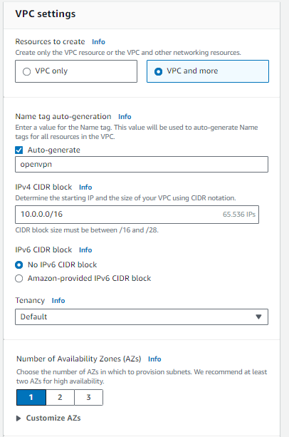

# Red en AWS

# Crear red con varios hosts en AWS (opcional)

Abrimos nuestra consola de AWS

## Crear una VPC

Vamos al servicio **VPC > Create VPC**

y creamos una VPC con la siguiente configuración:




## Crear un par de claves para SSH

Vamos a **EC2 > Key Pairs > Create key pair**

y creamos un key pair con la siguiente configuración:


Al crearla nos descargará un archivo `openvpn_key.pem` que deberemos guardar en un directorio de nuestra PC para luego acceder a las instancias EC2 por SSH.

## Crear una instancia EC2

Vamos a **EC2 > Launch Instance**

Elegimos la AMI deseada (en este caso usaremos Ubuntu), el tipo de instancia y el par de claves generado en el paso anterior.


Más abajo, en **Network Settings** haremos click en **Edit** para editar la configuración de la red en la que estará nuestro EC2.

**Para el caso de la instancia EC2 en la subnet pública que será nuestro OpenVPN Server:**

Seteamos la VPC y public subnet creadas. 

Le pedimos que nos asigne una IP pública

Creamos un Security Group con nombre personalizado.

Habilitamos las conexiones por SSH de cualquier destino, y conexiones TCP al puerto 1194.


Para el caso de otra instancia EC2 que se desee crear, establecer las configuraciones de red que crea pertinentes, siempre que se mantenga dentro de la misma VPC. Tenga en cuenta que si utiliza otro Security Group, deberá establecer las reglas necesarias para que se comuniquen.

Finalmente le damos a **Launch Instance** para crear la instancia EC2.

## Conectarse a una instancia EC2 mediante SSH

En el directorio donde hayamos guardado el archivo `openvpn_key.pem`, abrimos una terminal y corremos:

```bash
# Como la instancia es ubuntu, el usuario default es "ubuntu". 
# Si se usa otra AMI, investigar el username default correspondiente
ssh -i ./openvpn_key.pem ubuntu@3.95.233.240
# La primera vez nos preguntará si deseamos continuar porque la clave 
# no es conocida, y le contestamos 'yes'
```