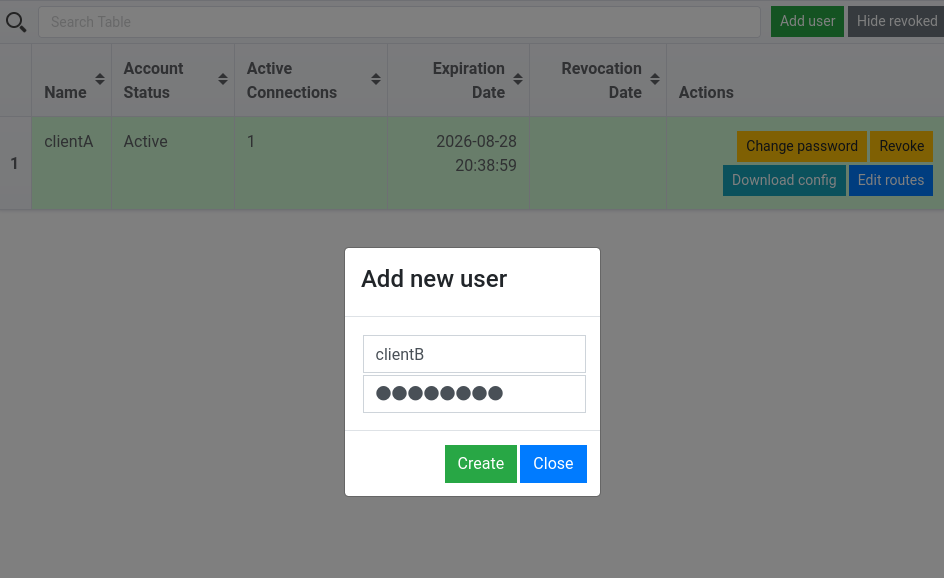
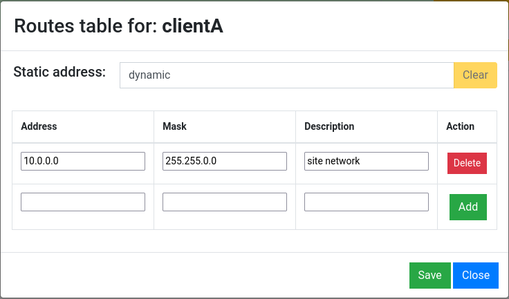

# Ovpn-admin (UI)

**Aclaración:** esta interfaz no fue implementada por nosotros. Sin embargo, consideramos que puede ser útil para una configuración rápida y sencilla de un servidor OpenVPN, por lo que hicimos un breve instructivo sobre cómo utilizarla. Link al repositorio del autor:
[https://github.com/flant/ovpn-admin](https://github.com/flant/ovpn-admin)

Es una interfaz simple para administrar un servidor OpenVPN que permite crear clientes con sus certificados y generar el `client.conf` de manera automática. Permite hacer configurar una conexión cliente a sitio sólo desde la interfaz.

# Instalación y Uso

Primero, necesitamos tener instalado `docker` y `docker-compose` 

Además, debemos **activar el forwardeo de paquetes** en el servidor.

Descargamos el repositorio

```bash
git clone https://github.com/flant/ovpn-admin.git
cd ovpn-admin
```

En este directorio, modificamos el archivo `docker-compose.yaml`

```yaml
version: '3'

services:
  openvpn:
    build:
      context: .
      dockerfile: Dockerfile.openvpn
    image: openvpn:local
    command: /etc/openvpn/setup/configure.sh
    environment:
      OVPN_SERVER_NET: "10.8.0.0"       # red del túnel
      OVPN_SERVER_MASK: "255.255.0.0"   # máscara del sitio
      OVPN_PASSWD_AUTH: "true"
    cap_add:
      - NET_ADMIN
    ports:
      - 7777:1194
      - 8080:8080
    volumes:
      - ./easyrsa_master:/etc/openvpn/easy-rsa
      - ./ccd_master:/etc/openvpn/ccd
  ovpn-admin:
    build:
      context: .
    image: ovpn-admin:local
    command: /app/ovpn-admin
    environment:
      OVPN_DEBUG: "true"
      OVPN_VERBOSE: "true"
      OVPN_NETWORK: "10.8.0.0/16"           # red del túnel
      OVPN_CCD: "true"
      OVPN_CCD_PATH: "/mnt/ccd"
      EASYRSA_PATH: "/mnt/easyrsa"
      OVPN_SERVER: "3.92.167.237:7777:tcp"  # ip pública del openvpn server
      OVPN_INDEX_PATH: "/mnt/easyrsa/pki/index.txt"
      OVPN_AUTH: "true"
      OVPN_AUTH_DB_PATH: "/mnt/easyrsa/pki/users.db"
      LOG_LEVEL: "debug"
    network_mode: service:openvpn
    volumes:
      - ./easyrsa_master:/mnt/easyrsa
      - ./ccd_master:/mnt/ccd

```

Iniciamos el servidor con

```bash
sudo ./start.sh
```

Podemos conectarnos a la interfaz de configuración en `http://ip-servidor:8080/` 



En ella podemos crear un cliente con un username y password

Al cliente creado le podemos agregar entradas a su tabla de ruteo con **Edit Routes**



Por ejemplo, agregamos la red del sitio.

Luego, para el cliente generado si hacemos click en **Download Config**, nos descarga un archivo `clientA.ovpn`

Si estamos en Windows, nos sirve como está. Si estamos en Linux, le cambiamos la extensión a `clientA.conf` y lo movemos a la carpeta `/etc/openvpn/`

Finalmente, comenzamos el cliente con `sudo systemctl start openvpn@clientA`

Nos pedirá el usuario y contraseña que establecimos anteriormente

Si queremos hacer una conexión sitio-a-sitio, si bien no se puede hacer sólo con la interfaz, bastará con modificar el archivo `./ccd_master/clientA` y agregarle la siguiente línea con la red del cliente.

```bash
iroute 192.168.0.0 255.255.255.0
```
